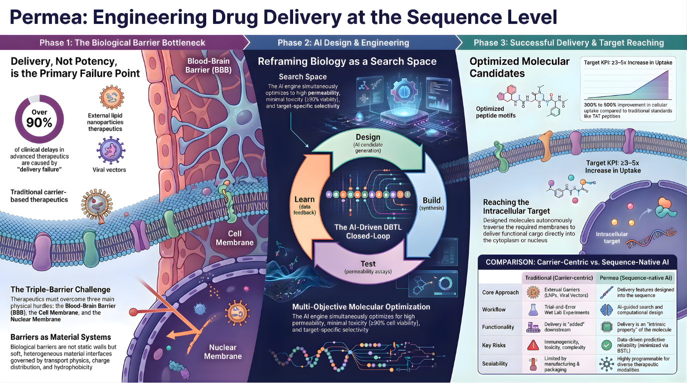

<div align="center">  <br />  </div>
<div align="center">

# PERMEA CORE

Open toolkit and benchmarks for sequence-first delivery and mRNA expression engineering.

Open by default. Reproducible by design.

<p align="center">


</p>

</div>

## Intro

Permea Core is a public technical foundation for sequence-first delivery and mRNA expression engineering.

It is being built as an open toolkit and benchmarks program: a disciplined repository for specifications, architecture decisions, research framing, and reproducible workflows.

## Why Permea Exists

Work related to delivery-aware sequence modeling is often difficult to compare across papers, internal pipelines, and one-off analyses. Task definitions vary, provenance is frequently incomplete, and evaluation logic is rarely organized for external reuse.

Permea exists to address that gap with a benchmark-first approach:

- define benchmark tasks clearly
- expose assumptions and interfaces directly in the repository
- support reproducible workflows rather than presentation-only results
- make the work inspectable by outside technical contributors


*Biological barriers such as the BBB, the cell membrane, and the nuclear membrane remain major delivery constraints for large-molecule therapeutics.*

## What Permea Core Is

Permea Core is the base open-source layer of the Permea project. It is intended to provide:

- benchmark definitions for sequence-first delivery and mRNA expression engineering
- repository-level contracts for data, execution, and evaluation
- architecture and decision records that govern repository growth
- a public technical foundation for reproducible workflows and future reference implementations

It is not a claim of validated biological performance. It is the technical program that should make later work legible and comparable.

## Repository Documents

- [Manifesto](MANIFESTO.md)
- [Specification](docs/SPEC.md)
- [Architecture Design](docs/DD-ARCHITECTURE.md)
- [ADR-0001: Open-Source-First](docs/adr/ADR-0001-open-source-first.md)
- [ADR-0002: Benchmark-First](docs/adr/ADR-0002-benchmark-first.md)

## Current Scope

The current scope is deliberately narrow:

- establish project principles and repository standards
- specify benchmark-oriented system boundaries
- define architecture and decision records
- align future implementation work around reproducibility and provenance

## Why Open Source

Permea is open-source-first because the value of an open toolkit and benchmarks program depends on inspection. If benchmark tasks, evaluation logic, and reproducible workflows are not visible, they are difficult to trust, extend, or compare.

Open development also imposes useful discipline:

- assumptions must be written down
- benchmark definitions must be stable enough to review
- claims must remain tied to methods and artifacts
- repository growth must stay legible to external contributors

## Repository Structure

```text
README.md
MANIFESTO.md
docs/
examples/
research/
notebooks/
results/
src/
assets/
```
