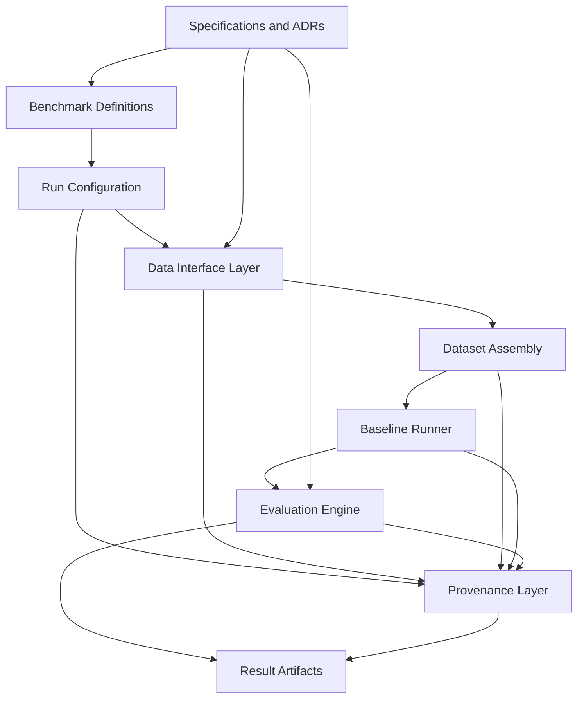

# Permea Core Architecture Design Document

## Title

Permea Core: Architecture and Execution Design

## Objective

This document defines the practical architecture for Permea Core as an early-stage, benchmark-first public technical foundation. The objective is to support benchmark definition, data preparation, baseline execution, evaluation, and provenance capture through a structure that is implementable, inspectable, and compatible with reproducible workflows.

The design is intentionally narrow. It prioritizes clear module boundaries over broad feature coverage.

## Design Principles

- benchmark-first: benchmark definitions should govern execution and evaluation surfaces
- open-source-first: repository contracts should be legible to external contributors
- reproducible workflows: benchmark outputs should be rerunnable from explicit code and configuration
- separable concerns: benchmark semantics, execution logic, and evaluation logic should remain distinct
- provenance by default: benchmarked outputs should carry enough metadata to support audit and comparison

## High-Level Architecture

Permea Core is organized around a benchmark-centered execution flow. Benchmark definitions, run configuration, and provenance records are first-class system surfaces rather than secondary implementation details.

## Main Modules

### Benchmark Registry

Defines benchmark identifiers, benchmark versions, task metadata, expected schemas, and metric bindings. This module establishes what a benchmark run means.

### Data Interface Layer

Defines the contracts for source records, delivery context, derived dataset references, and validation boundaries. This layer should isolate data representation from benchmark execution logic.

### Dataset Assembly

Transforms validated inputs into benchmark-ready datasets through explicit, reviewable preprocessing steps. Dataset assembly should expose its assumptions and parameters rather than burying them in notebooks.

### Baseline Runner

Executes a reference baseline or future model implementation through a standard interface. The runner should consume benchmark-ready datasets and emit standardized outputs.

### Evaluation Engine

Computes benchmark metrics using versioned evaluation logic tied to benchmark definitions. This module exists so that outputs remain comparable across runs and implementations.

### Provenance Layer

Captures the run manifest for each benchmarked execution, including benchmark version, dataset reference, code revision, configuration reference, timestamp, and output artifact references.

## Data and Workflow Boundaries

Permea Core depends on a small number of strict boundaries:

1. Benchmark boundary
   Benchmark semantics should be defined in repository-level contracts, not embedded inside model code.

2. Data boundary
   Source record validation and dataset references should be handled before runner execution begins.

3. Execution boundary
   Baseline execution should operate on benchmark-ready datasets and emit standardized outputs.

4. Evaluation boundary
   Metric computation should be centralized and versioned so repeated runs remain comparable.

5. Provenance boundary
   Result artifacts should be accompanied by explicit provenance records rather than reconstructed later from notebooks or terminal history.

These boundaries are necessary to keep the repository usable as a public technical foundation.

## Benchmark Execution Flow

The intended benchmark execution flow is:

1. Resolve a benchmark identifier and benchmark version.
2. Load the run configuration associated with the execution.
3. Validate inputs through the data interface layer.
4. Assemble a benchmark-ready dataset.
5. Execute a baseline runner against that dataset.
6. Evaluate outputs using benchmark-defined metrics.
7. Write result artifacts and a corresponding provenance record.

This flow should remain the canonical path for benchmarked outputs.

## Reproducibility and Provenance Rules

Permea Core should treat the following as required for canonical benchmark outputs:

- explicit benchmark identifier and benchmark version
- stored or reconstructable run configuration
- recorded code revision
- identifiable dataset reference
- machine-readable result artifacts
- provenance records written alongside outputs
- versioned evaluation logic tied to repository state

Outputs that cannot satisfy these conditions may still be useful for exploration, but they should not be treated as benchmark results.

## Constraints and Risks

### Constraints

- the project is early stage and should avoid unnecessary platform complexity
- repository documents must remain aligned with actual system intent
- scientific claims must remain narrower than the infrastructure scope of the project
- open-source-first development requires documentation quality that supports outside review

### Risks

- benchmark definitions may remain too abstract if implementation lags too far behind documentation
- exploratory analysis may drift away from repository-standard execution paths
- provenance requirements may be weakened if convenience overrides consistency
- model-specific logic may leak into benchmark and evaluation surfaces

The architecture should be judged by whether it reduces these risks while keeping the system implementable.

## Near-Term Implementation Plan

The near-term plan remains narrow and practical:

- define benchmark registry conventions
- define data and result interface contracts
- define provenance requirements for benchmarked runs
- support a first standard execution path for a reference baseline
- keep exploratory work secondary to benchmark-first repository contracts

The purpose of this phase is to establish a stable technical base for later implementation, not to maximize surface area.
